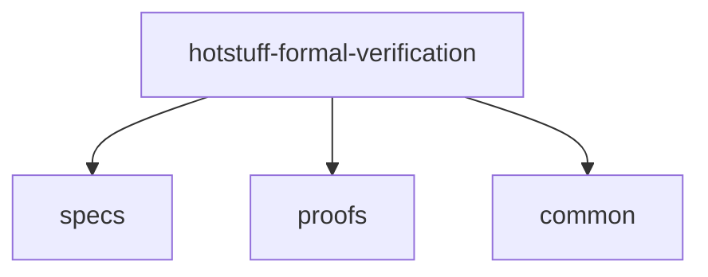

# Formal Analysis of HotStuff Protocols
This repository provides a formal model for verifying [HotStuff](https://dl.acm.org/doi/10.1145/3293611.3331591) consensus protocol, written in [Dafny](https://dafny.org/) language.
All codes in this repository have been tested and verified successfully in **_Dafny 4.9.0_**

This project is construted as follows.

- The folder [specs](specs) contains all the implementation of protocol specifications, including **type system**, **replica behaviours**, etc.
- **Theorems** and **lemmas** are written in [proofs](proofs).
- [common](common) writes some useful utilities, such as common proof strategies, or converting a seq to a set, etc.

# How to execute verification in Dafny
There are several ways to verify this model in Dafny. Here we show 2 commonly used ways : 1. Verify in VSCode IDE. 2. Verify in Dafny Command Line Interface.
* Verify in VSCode IDE
  - [Install Dafny extension in VSCode](https://dafny.org/latest/Installation#Visual-Studio-Code).
  - Open the file you want to verify.
  - There will be a grey curly arrow icon at the left of the name of each module, function, lemma, etc.
  - Click the icon and Dafny will start to verify, the icon will change to a green tick icon if the verification succeed.
* Verify in Command Line Interface
  - Install Dafny in your OS, for example, installing in [Mac](https://dafny.org/latest/Installation#Mac-binary).
  - run this command in terminal : **_dafny verify --verify-included-files --standard-libraries $target_file_**
  - _$target_file_ is the file path of the file your want to verifiy. For example, to verify safety property of HotStuff (Defined in **proofs/Theorem.dfy**), you can run this command : **_dafny verify --verify-included-files --standard-libraries proofs/Theorem.dfy_**
  - Dafny will show the verification result in your terminal.
