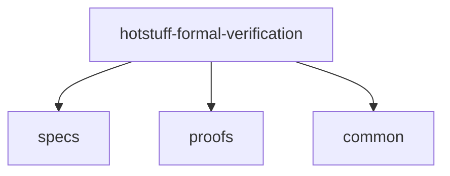

# hotstuff-formal-verification
This repository provides a formal model for verifying [HotStuff](https://dl.acm.org/doi/10.1145/3293611.3331591) consensus protocol, written in [Dafny](https://dafny.org/) language.

This project is construted as follows.

- The folder [specs](specs) contains all the implementation of protocol specifications, including **type system**, **replica behaviours**, etc.
- **Theorems** and **lemmas** are written in [proofs](proofs).
- [common](common) writes some useful utilities, such as common proof strategies, or converting a seq to a set, etc.
